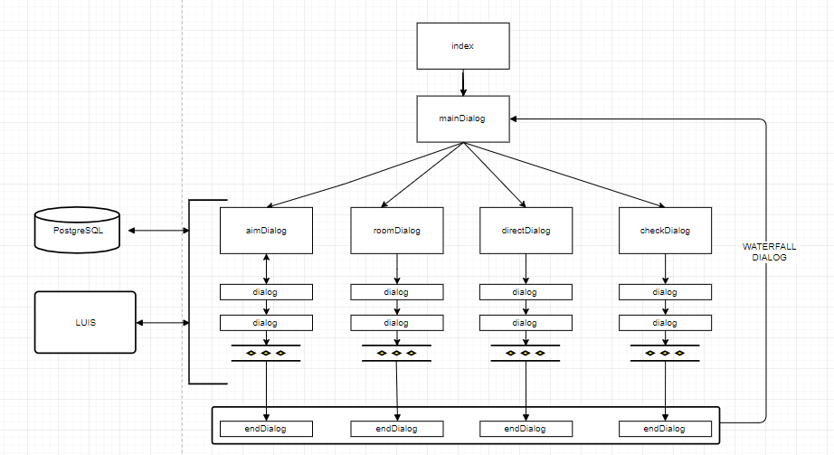
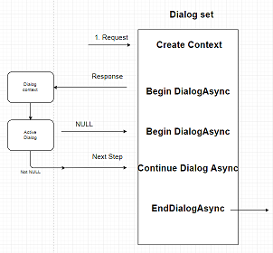
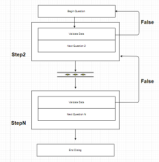
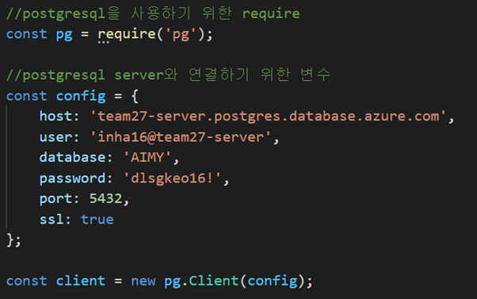
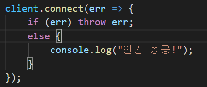

# Aimy란?

  사용자의 목표를 간편하게 관리해주고 목표달성을 도와주는 챗봇입니다.

## Aimy의 목적

  집에 있는 날이 많아진 요즘 상황에서 혼자서 목표를 세우고 그것을 실천하는 것은 어려운 일입니다.

  하나보단 둘이 낫다는 말이 있듯이, 같은 목표를 가진 여러명과 함께 목표달성을 체크해가며 사용자가
  목표달성을 보다 잘 이룰수 있는 챗봇을 만들고 싶었습니다. 


<div id="index">


## 목차


  1. 프로그램 시행 전 설치 파일

  - [1-1 미리 설치해야될 파일들](#1)
  - [1-2 실행하기에 앞서](#2)
 


  2. Aimy의 Logic
  - [Aimy의  Logic](#logic)

  3. Aimy의 코드 설명
  - [3-1 Dialog에 대한 설명](#waterfall)
  - [3-2 BOTFRAMEWORK에서 쓰이는 코드](#botframework)
  - [3-3 index.js](#3)
  - [3-4 dialogAndWelcomeBot.js 와 dialog.js](#4)
  - [3-5 DB.js](#5)
  - [3-6 waterFallDialog 구현](#6)

  4. LUIS와 PostgreSQL 그리고 AZURE의 연동
  - [LUIS와 챗봇 연동시키는 방법](#luis)
  - [PostgreSQL 연동하는 방법](#postgresql)
  - [AZURE 연동하는 방법](#azure)
  
  5. [코드 시연 영상](#youtube)
  6. [도움받은 사이트](#help)
</div>

<div id="1">

## 1. 프로그램 시행 전 설치 파일

### 1-1 미리 설치해야될 파일들

 1. VisualStudioCode https://code.visualstudio.com/download
 2. gitBash https://git-scm.com/downloads
 3. Azure CLI https://docs.microsoft.com/ko-kr/cli/azure/?view=azure-cli-latest
 4. BotFramework-Emulator https://github.com/Microsoft/BotFramework-Emulator/blob/master/README.md
 5. NodeJS  - https://nodejs.org/en/download/
 6. Yeoman.io
 7. pgadmin https://www.pgadmin.org/download/
   
</div>


<div id="2">

### 1-2 실행하기에 앞서

 1. 에코봇 만들기 https://docs.microsoft.com/ko-kr/azure/bot-service/javascript/bot-builder-javascript-quickstart?view=azure-bot-service-4.0
 2. PostgreSQL https://docs.microsoft.com/ko-kr/azure/postgresql/connect-nodejs
 3. LUIS 를 챗봇과 연동시키기 https://docs.microsoft.com/ko-kr/azure/cognitive-services/luis/luis-nodejs-tutorial-bf-v4
   
    [LUIS 연동하는법 자세히 알아보기](#luis)

 4. <class id="db">PostgreSQL</class>
   
</div>

## 2. Aimy의  Logic
   <class id=logic> 
   
   
   </class>

## 3. Aimy의 코드 설명


<div id="waterfall">

### 3-1 Dialog 설명


 1. 코드를 설명하기에 앞서, Aimy는 WaterFallDialog를 응용한 코드임을 알아야 한다. 그렇다면, Dialog는 bot framework에서 어떻게 쓰이는 것일까?
 2. Dialog란, 봇을 구현 함에 있어서 반복을 피하기위해 잇달아서 함수를 부르는 구조이다.
    
    
    
 3. 그렇다면 WaterFallDialog는 무엇일까? WaterFallDialog 란 사용자에게서 일련의 입력값을 받기 위해 각 Dialog를 step별로 거치고, 그전에 단계에서 값을 받지 못한 단계들은 되롤리면서 그전 단계에서 값을 제대로 받았는지 확인할 수 있다.
   
    

</div>

<div id="botframework">

### 3-2 BOTFRAMEWORK에서 쓰이는 코드

  1. Prompt: 사용자에게서 입력을 받고싶을때 쓰이는 함수이다.사용자에게 메세지를 보내며 사용자가 입력하기를 기다리는 함수이다.
   
      [자세히 알아보기](https://docs.microsoft.com/ko-kr/azure/bot-service/nodejs/bot-builder-nodejs-dialog-prompt?view=azure-bot-service-3.0)
  2. ActivityHandler class : event발생시 감지하는 역할을 한다.  onMembersAdded와 onMessage함수를 사용하기 위해 쓰인다.
    
      [자세히 알아보기](https://docs.microsoft.com/en-us/javascript/api/botbuilder-core/activityhandler?view=botbuilder-ts-latest)
  3. ChoicePrompt, DateTimePrompt, NumberPrompt, TextPrompt: 사용자의 입력값을 받기 위한 botbuilder-dialogs 안에 있는 클래스들이다.
   
      [자세히 알아보기](https://docs.microsoft.com/en-us/dotnet/api/microsoft.bot.builder.dialogs?view=botbuilder-dotnet-stable)

      Aimy의 코드에서는 다음과 같이 쓰였다.

      <aimDialog.js>
        ```
          const { ChoicePrompt, DateTimePrompt, NumberPrompt, TextPrompt } = require('botbuilder-dialogs');

          const CHOICE_PROMPT = 'CHOICE_PROMPT';
          const NUMBER_PROMPT = 'NUMBER_PROMPT';
          const TEXT_PROMPT = 'TEXT_PROMPT';
          const DATETIME_PROMPT = 'DATETIME_PROMPT';

          ... dialog에서 사용하기 위해 사용할 prompt를 addDialog로 선언해준다.
          class aimDialog extends ComponentDialog {

               constructor() {
                super(AIM_DIALOG);
              this.addDialog(new TextPrompt(TEXT_PROMPT));
              this.addDialog(new ChoicePrompt(CHOICE_PROMPT));
              this.addDialog(new DateTimePrompt(DATETIME_PROMPT));
              this.addDialog(new NumberPrompt(NUMBER_PROMPT));
          
          ...이후 dialog에서 prompt를 통해 입력값을 받는다.
          async choiceStep(step) {
            endDialog = false;
            return await step.prompt(CHOICE_PROMPT, '명령을 선택해주세요', ['추가', '삭제', '수정']);
          }

        ```
  4. module.exports : 사용자의 모듈을 만들어서 파일을 속성이나 메소드로 사용하는 방식이다. 각 js파일을 만들고 다른 js파일에서 require을 통해 사용하기 위해선 반드시 써줘야 한다. 예시)
      ```
         module.exports.aimDialog = aimDialog;
      ```

</div>

<div id="3">

### 3-3 index.js
 1. [1-2의 에코봇 만들기](#2)를 실행하면 index.js파일이 생기는데 이때 index.js란 모듈이 실행되는데 필요한 entry point 를 가르킨다.
 2. Aimy는 WaterFallDialog를 통해 구현되기 때문에  Dialog 를 구분짓기 위한 변수 UserState,ConverSationState 그리고 이를 저장하기 위한 MemoryStorage를 사용한다.
   state에 대한 자세한 설명은 https://docs.microsoft.com/en-us/azure/bot-service/bot-builder-concept-state?view=azure-bot-service-4.0#state-management 을 참고하자.
 3. 
   ```
   const { BotFrameworkAdapter, MemoryStorage, UserState, ConversationState }   = require('botbuilder');

    const { DialogAndWelcomeBot } = require('./bots/dialogAndWelcomeBot');
    const { MainDialog } = require('./componentDialogs/mainDialog');
    const memoryStorage = new MemoryStorage();

    const userState = new UserState(memoryStorage);
    const conversationState = new ConversationState(memoryStorage);

    const dialog = new MainDialog(userState);
    const bot = new DialogAndWelcomeBot(conversationState, userState, dialog);
    
    server.post('/api/messages', (req, res) => {
    adapter.processActivity(req, res, async (context) => {
        // Route to main dialog.
        await bot.run(context);
        });
    });
   ```
4. 결론적으로, index.js으로 시작하게 되면 dialogAndWelcomeBot.js을 실행하게 된다.


</div>
<div id="4">

### 3-4 dialogAndWelcomeBot.js 와 dialog.js

   1. bot에서 발생하는 메인 이벤트에는 onMembersAdded 이벤트와 onMessage 이벤트 두가지가 있다.
   2. onMembersAdded는 새로운 유저가 봇에 연결될때마다 호출되는 함수이다.
      
        <dialogAndWelcomeBot.js>
        ```
          const { DialogBot } = require('./dialogBot');// DialogBot 클래스를 상속받는다

          class DialogAndWelcomeBot extends DialogBot {
                constructor(conversationState, userState, dialog) {
                super(conversationState, userState, dialog);

          this.onMembersAdded(async (context, next) => {
            const membersAdded = context.activity.membersAdded;
            for (let cnt = 0; cnt < membersAdded.length; cnt++) {
                if (membersAdded[cnt].id !== context.activity.recipient.id) {
                    const reply = `안녕하세요 ${ membersAdded[cnt].name }님 \n 계속하시려면 아무 말이나 눌러주세요`;
                    await context.sendActivity(reply);
                }
            }

            // By calling next() you ensure that the next BotHandler is run.
            await next();
                 });
         }
        ```

   3. 새로운 유저가 연결될 때마다 onMembersAdded함수가 이벤트를 감지하여 reply를 유저에게 보내주게 된다.
   4. dialogBot.js는 사용자에게서 메세지가 올때마다 onMessage()함수를 통해 mainDialog.js를 실행시켜주는 역할을 한다.
   5. index에서도 설명했듯이 dialog를 실행하기 위해 conversationState와 userState를 통해 context가 원하는 dialog로 들어가게끔 한다.

        ```
            const { ActivityHandler } = require('botbuilder');
            const {MainDialog} = require('../componentDialogs/mainDialog');
            class DialogBot extends ActivityHandler {
                constructor(conversationState, userState,dialog) {
                    super();
                    
                    this.conversationState = conversationState;
                    this.userState = userState;
                    this.dialog = dialog;
                    this.dialogState = conversationState.createProperty("dialogState");
                    this.MainDialog = new MainDialog(this.userState);
       
                    this.onMessage(async (context, next) => {
                      await this.dialog.run(context, this.dialogState);
                      await next();
                 });
               }

               //run()함수는 dialog의 핵심 함수로써 dialog step의 실행을 관리한다.
               async run(context) {
               await super.run(context);
               var isEnd = await this.MainDialog.isEndDialog();
        
               // dialog의 실행에 발생하는 state 변화를 저장한다.
               await this.conversationState.saveChanges(context, false);
               await this.userState.saveChanges(context, false);

                if (isEnd) {
                  await super.run(context);
                }
               }
            }
        ```

   6. 따라서 onMessage로 context가 들어오게 되면, run()을 통해 현재 상태에 따라 각자의 Dialog로 나눠지게 된다.
 
</div>


<div id="5">

### 3-5 DB.js
   1. Dialog에서 값을 DB에서 불러오기 위해 DB.js에 있는 함수를 호출하게 된다.
   2. DB.js에서는 각각의 함수들이 DB에서 원하는 값을 가져오거나 저장할 수 있도록 쿼리들이 저장되어 있다.
   3. 앞서, [DB연결하기](#db) 에서 성공적으로 연결했다면
    
    
      ```
        //postgresql을 사용하기 위한 require
          const pg = require('pg');

        //postgresql server와 연결하기 위한 변수
          const config = {
            host: 'team27-server.postgres.database.azure.com',
            user: 'inha16@team27-server',
            database: 'AIMY',
            password: 'dlsgkeo16!',
            port: 5432,
            ssl: true
          };
          const client = new pg.Client(config);

          class DB {
            constructor() {
         async queryShowAim(userNum){ 
            const query = `select * from aim where userId = '${userNum}'`;//수행하고자 하는 쿼리입력
            return await client.query(query);//쿼리 수행
             }
      ```
      
         을 통해 쿼리를 수행하게끔 할 수 있다.

      <aimDialog.js>
      
      이제 Dialog에서 이 함수를 불러오려면
        ```
            const { database } = require('../DBconnect');//DB와 연결하는 정보를 담은 js파일

            var res = await database.queryShowAim(userName);
            const rows = res.rows;
            rows.map(row => {
                step.context.sendActivity(`${this.showAimClearAll(row)}`);
            });

        ```
       4. userName이 위의 queryShowAim함수로 들어가 쿼리를 실행한후에 res에 쿼리의 return값을 저장하게 된다
       5. rows = res.rows;를 통해 rows에 res 값을 한 줄씩 저장하게 된다.
       6. 이후 rrows.map(row => {}); 을 통해 한줄씩 sendActivity하게 된다.
    

</div>

<div id="6">

### 3-6 waterFallDialog 구현
<amDialog.js>
   
1. WaterFallDialog를 사용하려면 ComponentDialog 와 WaterFallDialog 클래스를 상속받아야 한다
   ```
   class aimDialog extends ComponentDialog {

    constructor() {
        super(AIM_DIALOG);
        

        this.addDialog(new TextPrompt(TEXT_PROMPT));
        this.addDialog(new ChoicePrompt(CHOICE_PROMPT));
        this.addDialog(new DateTimePrompt(DATETIME_PROMPT));


        this.addDialog(new WaterfallDialog(WATERFALL_DIALOG, [
            this.choiceStep.bind(this), 
            this.detailStep.bind(this),  
            this.typingStep.bind(this),  
            this.secondChoice.bind(this), 
            this.summaryStep.bind(this), 
            this.processStep.bind(this)

        ]));

        this.initialDialogId = WATERFALL_DIALOG;
    }

   ```
2. [WaterFallDialog](#waterfall)의 그림을 보면 알수있듯이 WaterFallDialog를 구성하기 위해서는 Dialog 안에 여러 step들이 있어야 한다.
   ```
    const { WaterfallDialog, ComponentDialog } = require('botbuilder-dialogs');
    this.addDialog(new WaterfallDialog(WATERFALL_DIALOG, [
            this.choiceStep.bind(this),
            this.detailStep.bind(this),  
            this.typingStep.bind(this),  
            this.secondChoice.bind(this),
            this.summaryStep.bind(this), 
            this.processStep.bind(this) 

        ]));
   ``` 
3. 이렇게 함으로써 waterFalldialog는 detailStep, typingStep, secondeChoice, summaryStep, processStep의 순서로 진행되게 된다.
4. 하나의 단계에서 어떻게 진행되는지 구체적으로 살펴보자
   ```
    async choiceStep(step){
        endDialog = false;
        return await step.prompt(CHOICE_PROMPT,'명령을 선택해주세요',['추가','삭제','수정']);

    }
     async detailStep(step){
        step.values.choice = step.result;
   ```
   사용자가 선택지를 누르게 되면 다음 step인 detailStep 으로 넘어가게되고 detailStep에서 전에 입력한 값을 step.result을 통해 받을 수 있게 된다.
   받은 step.result값은 step.value.변수이름 에 저장함으로써 다음 단계에서 값을 사용할 수 있게 된다.

5. 마지막으로, WaterFallDialog의 마지막 단계까지 오게되면
   ```
   async processStep(step){

                endDialog = true;
                return await step.endDialog();//dialog 종료

         }
   ```
   enDialog값을 true로 바꿔주고 endDialog()를 실행함으로써 WaterFallDialog가 끝나게 된다.

6. [Aimy의 구조](#logic)에서 볼 수 있듯이 mainDialog는 사용자에 입력에따라 각 WaterFallDialog로 입력값을 보내는 역할을 한다.
7. mainDialog에서 분류가 된후에는, 각각의 WaterFallDialog로 입력값들이 들어가게 된다.
</div>


<div id="luis">

## 4.LUIS와 챗봇 연동시키는 방법
LUIS란? 자연어를 받아들여 문장의 의미를 해석하는 머신러닝 기능을 탑재한 클라우드 베이스의 API 서비스이다. 사용자가 자연어를 입력시키면, 루이스를 통해 문장을 해석하여 원하는 값을 가져올 수 있게끔 사용하였다. 
1. https://www.luis.ai/applications 에 들어가서 Subscription과 Authoring resource를 클릭하고
  **New app for conversation** 을 클릭한다
2. 학습시키고 싶은 문장을 LUIS의 intent에 저장하고, 자연어를 입력했을때 추출하고 싶은 정보를 entity로 설정한다.
3. **Train**을 클릭한 후에 입력한 정보를 토대로 LUIS를 학습시킨다.
4. 학습이 완료 되었다면 **Publish**을 클릭한 후에 **production slot**을 선택하고 Done을 누른다.
5. 메뉴를 클릭해 Settings에 들어가 AppId를 복사하여 .env파일의 LuisAppId에 넣는다 , Azure Resources에 들어가 primary key를 복사하여 .env파일의 LuisAPIKey에 넣는다. .env파일의 LuisAPIHostName는 서버의 location을 적으면된다.
6. 사용하고자 하는 파일에 추가한다.
   ```
    const { LuisRecognizer } = require('botbuilder-ai');

    const dispatchRecognizer = new LuisRecognizer({
    applicationId: process.env.LuisAppId,
    endpointKey: process.env.LuisAPIKey,
    endpoint: `https://${process.env.LuisAPIHostName}.api.cognitive.microsoft.com`
    }, {
      includeAllIntents: true

    }, true);

    ```
7. LUIS를 통한 인자를 전달받는 방법
   ```
   const luisResult = await dispatchRecognizer.recognize(context);
   const intent =  LuisRecognizer.topIntent(luisResult);
   entities = luisResult.entities;
   ```

</div>

<div id="postgresql">

## 5. PostgreSQL과 챗봇 연동시키는 방법
  1. Nodejs용 postgresql 클라이언트인 pg를 설치합니다.
      npm install pg
  2. Azure postgresql 서버에서 서버이름과 관리자 사용자 이름을 기록해둡니다.

       


  3.	챗봇에 database.js 파일을 만들고 다음과 같이 적어준다.
     
        

  4.	그후 입력한 서버정보를 이용하여 연결한다.

        


</div>


<div id="azure">

## 6. AZURE에 등록하는 방법
  1. AZURE을 등록하기 위해서는 azure CLI, powershell, arm templates를 사용해야 합니다.
  2. AZURE에 등록을 하게되면 실제 Web에서도 챗봇이 작동하게끔 할 수 있습니다.
  3. [azure cli를 설치합니다.](https://docs.microsoft.com/ko-kr/cli/azure/install-azure-cli?view=azure-cli-latest)
  4. window powershell를 열어 다음 명령어를 실행합니다.
    
    az login
   
  5. 입력시 브라우저가 열리고 azure에 로그인을 할 수 있게 됩니다.
  6. 사용할 기본 구독을 설정합니다
    
      az account set --subscription "<azure-subscription>"
  
  7. Azure application등록을 위한 명령어 입니다. 이때 봇 프로그램은
  --available-to-other-tenants를 추가하고, 출력되는 항목중 appId를 기억하고 있어야 합니다.

       az ad app create --display-name "TEAM27_AIMY" --password "비밀번호" --available-to-other-tenants
  8. 먼저 cli상에서의 위치를 등록하려는 챗봇 프로그램의 최상위 폴더로 변경시켜야 합니다. 아래의 명령어는 RG_TEAM27리소스 그룹에 전단계에서 등록한 앱을 deploy하는 명령어 입니다.

      az deployment group create --resource-group "RG_TEAM27" --template-file "deploymentTemplates\template-with-preexisting-rg.json" --parameters appId="c677a2c4-2346-4dcf-81f7-e9d6d970b72c" appSecret="전단계 설정한 비밀번호" botId="TEAM27-AIMY" newWebAppName="TEAM27-AIMY" newAppServicePlanName="TEAM27-AIMY" appServicePlanLocation="westus" --name "TEAM27-AIMY"
  9.  아래의 명령어는 web.config파일을 생성합니다. deploy하기 위해 필요한 파일입니다.
      az bot prepare-deploy --code-dir "." --lang Javascript
  
  10. 위치한 폴더에서 node_modules폴더를 제외한 모든 파일과 폴더를 선택하여 압축하고 AIMY.zip으로 이름을 정합니다.
  azure에 봇을 배포할때는 .zip파일로 올릴수 있습니다.

  11. 아래의 명령어는 리소스그룹에 작성한 코드를 올려줍니다.

      az webapp deployment source config-zip --resource-group "RG_TEAM27" --name "TEAM27-AIMY" --src "AIMY.zip"
  
  12. Azure portal로 들어갑니다. 그리고 app service 편집기로 이동합니다.
  13. 이미지에 나와있는 코드를 입력합니다.

      
  14. 챗봇 링크를 만들기 위해 봇 채널 등록의 채널 탭에서 편집으로 들어갑니다.

      

  15. 임베드 코드에 적혀있는 링크와 암호키를 이용하여 링크를 생성하고 챗봇을 테스트합니다.

      


  
  


[봇 배포에 관해 자세히 알아보기](https://docs.microsoft.com/ko-kr/azure/bot-service/bot-builder-deploy-az-cli?view=azure-bot-service-4.0&tabs=csharp)

</div>


<div id="youtube">

## 7. 코드 시연 영상

https://youtu.be/9X4Stse-_eo

</div>

<div id= "help">

## 8. 도움받은 사이트

* [마이크로 소프트 자습서](https://docs.microsoft.com/ko-kr/azure/bot-service/javascript/bot-builder-javascript-quickstart?view=azure-bot-service-4.0)
* [봇프레임워크 버튼 만들기](http://blog.naver.com/warit)
* [WaterFallDialog에 대한 설명](https://www.c-sharpcorner.com/article/prompt-and-waterfall-dialog-in-bot-v4-framework-bot-builder-net-core/)
* [봇프레임워크 샘플](https://github.com/Microsoft/BotBuilder-Samples/blob/master/README.md)
* etc
</div>

## 9. 프로젝트를 진행하면서 느낀점

    처음에는 팀원들 모두 botframework는 처음 접하는 것이였고 javascript, json,c# 도 해본적 없는 상태라 막막했지만, 엄청난 기능을 하진 못하더라도 저희들만의
    챗봇을 만들어보자는 생각으로 이 대회에 도전하게 되었습니다. 시작은 어려워서 남들이 제공한 샘플코드를 읽는것이 고작이였지만 결국 한주 한주 열심히 배우다보니
    bot framework가 어떻게 동작하는 것인지 알 수 있게 되었고 완벽하진 않더라도 저희 팀만의 챗봇 Amiy를 만들 수 있게 되었습니다. 배우는 과정속에선 정보가 많이 
    없어서 힘들었지만 완성하고나니 보람찬것 같습니다.
